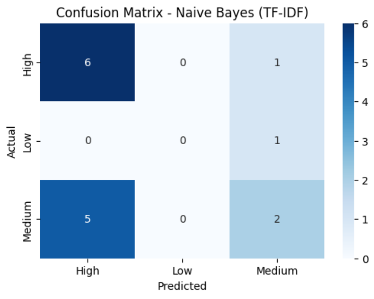
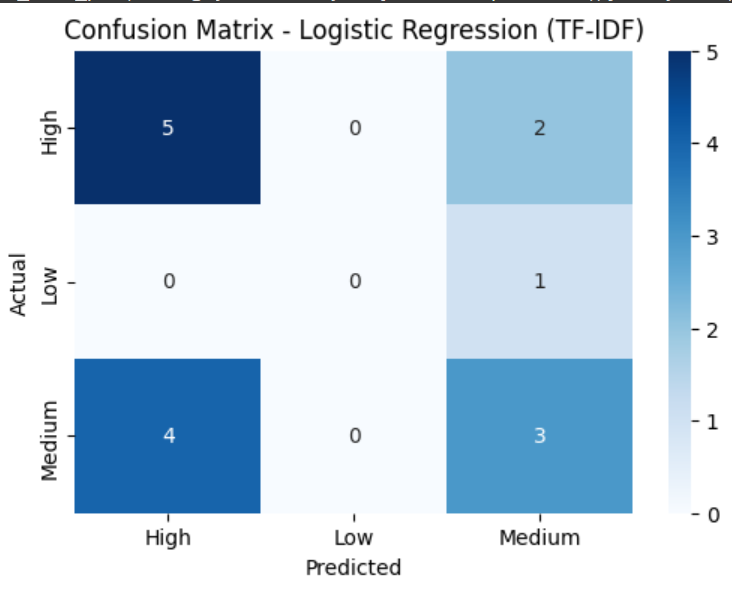
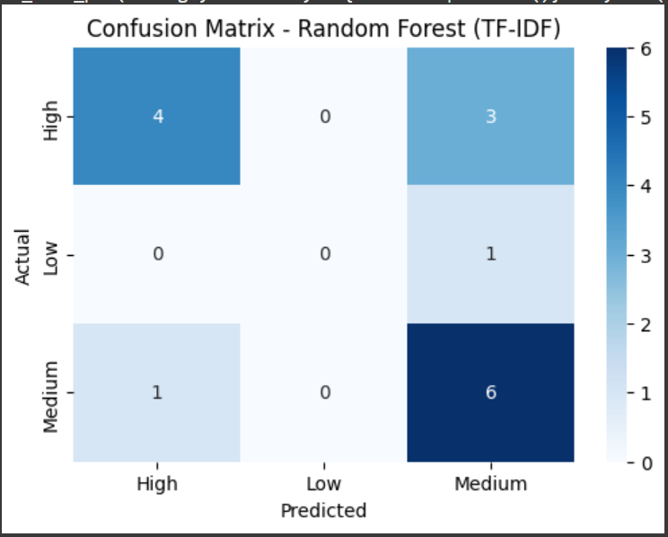
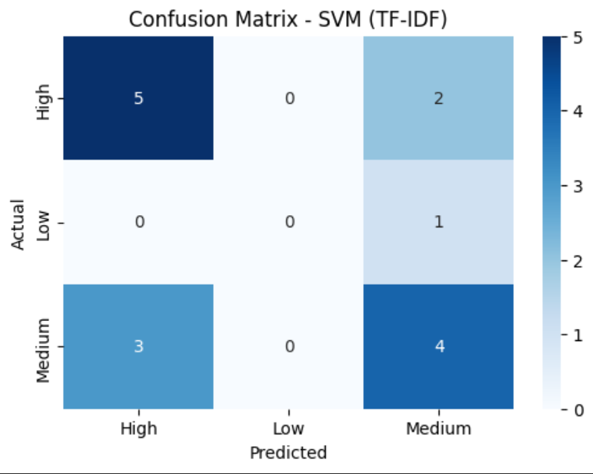
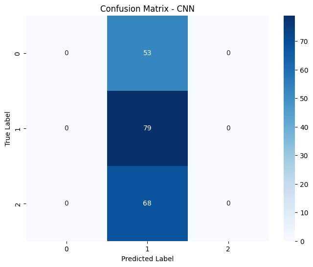
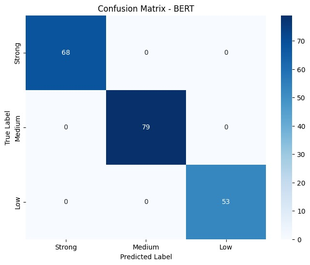
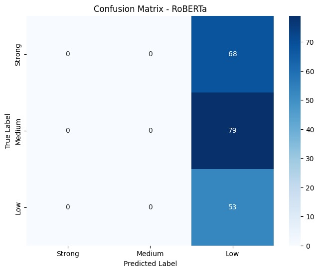
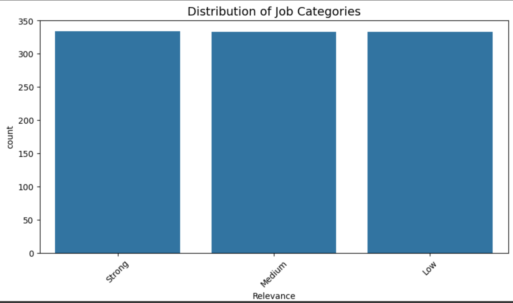

# 📚 Job Description Matching

### Course: NLP (Semester 6) - Pillai College of Engineering

## 📖 Project Overview
This project is part of the Natural Language Processing (NLP) course for Semester 6 students at Pillai College of Engineering. The project, "Job Description Matching" focuses on developing an AI-powered system capable of parsing, analyzing, and extracting key information from resumes to assist in recruitment processes.
**# Job Description Matcherusing NLP 📄🔍

Classifying job descriptions and candidate profiles based on relevance. This classification helps recruiters and hiring managers identify the best matches between job openings and candidates, ensuring efficient hiring processes.
## 🎯 Project Abstract
The recruitment process often involves manually matching job descriptions with candidate profiles, a task that can be time-consuming and prone to inefficiencies. This project seeks to develop a Natural Language Processing (NLP)- based job matching system designed to automate the classification of job descriptions and candidate profiles based on their relevance. The system analyzes and compares the textual content of job descriptions and candidate qualifications—including skills, education, and experience—to identify the best matches, improving the efficiency of the hiring process.
By employing TF-IDF vectorization for text representation and Cosine Similarity for measuring relevance, the model assesses how well a candidate’s profile aligns with job requirements. TF-IDF assigns importance to key terms, while Cosine Similarity computes the degree of match between the user input and various job descriptions. The model then ranks job opportunities based on their similarity scores, displaying the most relevant jobs at the top. Additionally, the system allows candidates to upload their resumes, automatically extracting relevant details and matching them against job descriptions for a seamless and accurate classification process.
This lightweight yet effective NLP approach ensures a fast and scalable recruitment process while maintaining high accuracy in candidate-job matching. By automating job classification, the system significantly reduces manual effort, accelerates hiring timelines, and enhances the objectivity of candidate selection. Ultimately, the project aims to streamline hiring workflows, enabling recruiters to efficiently identify top candidates and improve the overall recruitment experience.

---
## 🧠 Algorithms Used
### 📊 Machine Learning Algorithms
- Logistic Regression
- Random Forest
- XGBoost
- Naïve Bayes

### 🔥 Deep Learning Algorithms
- LSTM (Long Short-Term Memory)
- MLP (MultiLayer Perceptron)
- CNN (Convolutional Neural Network)

### 🤖 Language Models
- BERT (Bidirectional Encoder Representations from Transformers)
- RoBERTa

### 📝 Model Performance
| Model               | Features       | Test Accuracy |
|--------------------|----------------|----------------|
| Naive Bayes         | TF-IDF         | 0.875          |
| Logistic Regression | TF-IDF         | 0.885          |
| SVM                 | TF-IDF         | 0.885          |
| Random Forest       | TF-IDF         | 0.850          |
| Naive Bayes         | BoW            | 0.885          |
| Logistic Regression | BoW            | 0.885          |
| SVM                 | BoW            | 0.885          |
| Random Forest       | BoW            | 0.870          |
| Naive Bayes         | NLP-Features   | 0.295          |
| Logistic Regression | NLP-Features   | 0.445          |
| SVM                 | NLP-Features   | 0.420          |
| Random Forest       | NLP-Features   | 0.380          |
| Naive Bayes         | TF-IDF+NLP     | 0.875          |
| Logistic Regression | TF-IDF+NLP     | 0.885          |
| SVM                 | TF-IDF+NLP     | 0.300          |
| Random Forest       | TF-IDF+NLP     | 0.855          |
| Naive Bayes         | All-Features   | 0.885          |
| Logistic Regression | All-Features   | 0.885          |
| SVM                 | All-Features   | 0.300          |
| Random Forest       | All-Features   | 0.860          |

### TASK 1 Machine Learning Algorithms
### Confusion Matrix - Naive Bayes (TF-IDF)

### Confusion Matrix - Logistic_Regression (TF-IDF)

### Confusion Matrix - Random Forest (TF-IDF)

### Confusion Matrix - SVM (TF-IDF)

### TASK 2 Deep Learning Algorithm

### Confusion Matrix - LSTM 

### Confusion Matrix - CNN 

### Confusion Matrix - MLP 

### TASK 3 Language models

### Confusion Matrix - BERT 

### Confusion Matrix - RoBERTa 

### 📊 Real-World Model Performance

| Model               | Features | Accuracy   |
|--------------------|----------|------------|
| Naive Bayes         | TF-IDF   | 0.533333   |
| Logistic Regression | TF-IDF   | 0.533333   |
| SVM                 | TF-IDF   | 0.600000   |
| Random Forest       | TF-IDF   | 0.666667   |

### Validation

---
